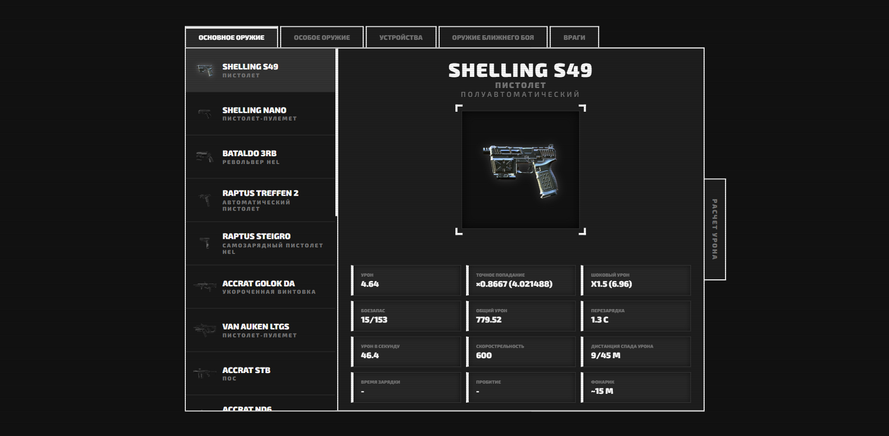
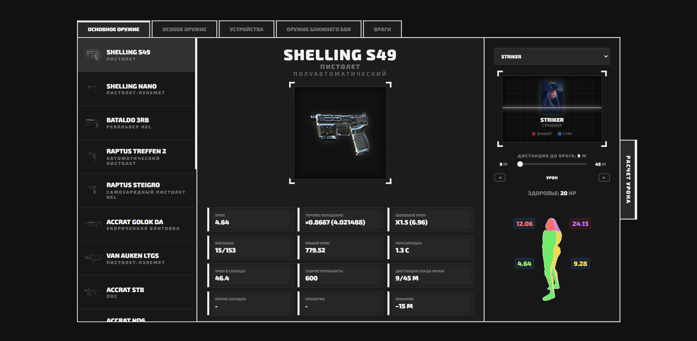

# 🛠️ GTFO DATABASE & DAMAGE CALCULATOR
Интерактивный справочник и калькулятор урона для игры GTFO. Создан для быстрого анализа характеристик оружия и расчета эффективности против различных типов врагов.

# ✨ Основные возможности
Полная база данных: Подробные характеристики основного, специального и холодного оружия.

Справочник врагов: Уязвимые точки, множители урона, показатели здоровья и степени опасности.

Интерактивный калькулятор: * Расчет количества выстрелов/ударов для убийства (Kill Thresholds).

Визуализация урона в разные части тела (голова, затылок, спина, тело).

Учет дистанции стрельбы и множителей скрытности для ближнего боя.

Адаптивный интерфейс: Дизайн в стиле игрового терминала с автоматическим масштабированием под размер окна браузера.

# 🚀 Как запустить
Проект не требует установки дополнительных библиотек или сборки.

Скачайте репозиторий.

Откройте файл index.html в любом современном браузере.

Либо откройте ссылку ниже.

[GTFO DATABASE & DAMAGE CALCULATOR](https://tyananime34-spec.github.io/GTFO-Database-Damage-Calculator/)

# 🛠️ Технологии
HTML5 / CSS3: Кастомная верстка с использованием CSS-переменных и Flexbox.

JavaScript (Vanilla): Логика расчетов, динамическая генерация контента и система вкладок.

WebP: Оптимизированные изображения для быстрой загрузки.

# 📸 Скриншоты

# 🤝 Авторство
Designed & Developed by perrfecct.
Данный инструмент разработан для сообщества GTFO. Все данные базируются на актуальных механиках игры.
